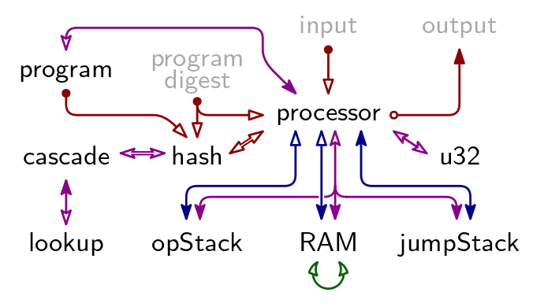

# Arithmetization

An arithmetization defines two things:
1. algebraic execution tables (AETs), and
1. arithmetic intermediate representation (AIR) constraints.

The nature of Triton VM is that the execution trace is spread out over multiple tables, but linked through permutation and evaluation arguments.

Elsewhere, the acronym AET stands for algebraic execution *trace*.
In the nomenclature of this note, a trace is a special kind of table that tracks the values of a set of registers across time.

## Algebraic Execution Tables

There are 8 Arithmetic Execution Tables in TritonVM.
Their relation is described by below figure.
A a blue arrow indicates a [Permutation Argument](permutation-argument.md), a red arrow indicates an [Evaluation Argument](evaluation-argument.md), a purple arrow indicates a [Lookup Argument](lookup-argument.md), and the green arrow is the [Contiguity Argument](contiguity-of-memory-pointer-regions.md).

Public (but not secret!) input and output are given to the Verifier explicitly.
As a consequence, neither the input nor the output symbols are recorded in a table.
Correct use of public input (respectively, output) in the Processor is ensured through an Evaluation Argument.
Given the list of input (or output) symbols, the verifier can compute the Evaluation Argument's terminal explicitly, and consequently compare it to the corresponding terminal in the Processor Table.

Despite the fact that neither public input nor output have a dedicated table, them having Evaluation Arguments with the Processor Table justifies their appearance in above figure.

### Base Tables

The values of all registers, and consequently the elements on the stack, in memory, and so on, are elements of the _B-field_, _i.e._, $\mathbb{F}_p$ where $p$ is the Oxfoi prime, $2^{64}-2^{32}+1$.
All values of columns corresponding to one such register are elements of the B-Field as well.
Together, these columns are referred to as table's _base_ columns, and make up the _base table_.

### Extension Tables

The entries of a table's columns corresponding to Permutation, Evaluation, and Lookup Arguments are elements from the _X-field_ $\mathbb{F}_{p^3}$.
These columns are referred to as a table's _extension_ columns, both because the entries are elements of the X-field and because the entries can only be computed using the base tables, through an _extension_ process.
Together, these columns are referred to as a table's _extension_ columns, and make up the _extension table_.

### Padding

For reasons of computational efficiency, it is beneficial that an Algebraic Execution Table's height equals a power of 2.
To this end, tables are padded.
The height $h$ of the longest AET determines the padded height for all tables, which is $2^{\lceil\log_2 h\rceil}$.

## Arithmetic Intermediate Representation

For each table, up to four lists containing constraints of different type are given:
1. Initial Constraints, defining values in a table's first row,
1. Consistency Constraints, establishing consistency within any given row,
1. Transition Constraints, establishing the consistency of two consecutive rows in relation to each other, and
1. Terminal Constraints, defining values in a table's last row.

Together, all these constraints constitute the AIR constraints.
